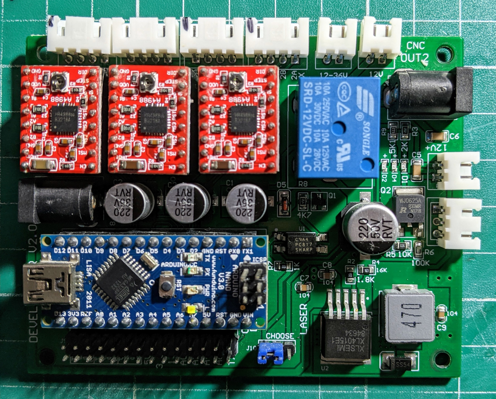
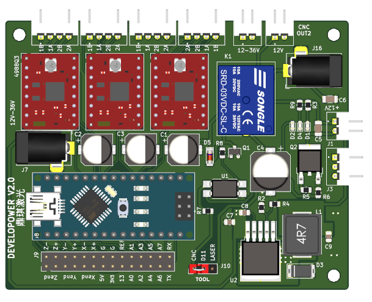

## Developower-v2.0

This project is an effort to recreate Developower-v2.0 board on Kicad.

This is the Developower-v2.0 board used on those Chinese 3018 CNC's.

This is the current version of the layout, but it is still a work in progress.

